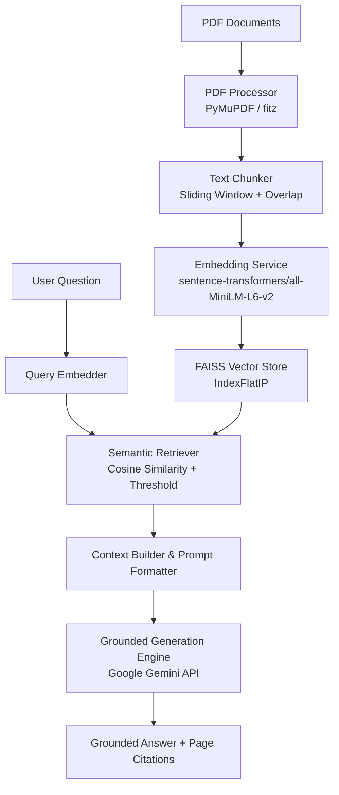

# 🧠 Intelligent Multi-Document RAG Assistant

A modern, high-performance Retrieval-Augmented Generation (RAG) system built with **Python**, **Flask**, **FAISS**, **Sentence Transformers**, and the **Google Gemini API**.

This project provides an end-to-end pipeline for ingesting PDF documents, extracting and cleaning text page-by-page, chunking text while preserving metadata, generating dense vector embeddings, performing similarity search in a FAISS vector index, and generating grounded, factual responses with exact document and page citations.

---

## 🌟 Architecture & Pipeline Overview

The application follows a modular, 6-stage RAG architecture:



---

## 🚀 System Pipeline & How It Works

### Step 1: PDF Extraction & Text Cleaning
- Extracts text page-by-page using **PyMuPDF (`pymupdf`)**.
- Sanitizes raw text by stripping non-printable control characters, repairing hyphenated line breaks (e.g., `trans-\nformer` → `transformer`), and normalizing whitespace.
- Validates documents against low-character thresholds to detect scanned or image-only PDFs.

### Step 2: Overlapping Text Chunking
- Segments page text into sliding-window word chunks (default: 600 words with 80-word overlap).
- Attaches provenance metadata to every chunk: `chunk_id`, `document_name`, `page_number`, `chunk_index`, and `word_count`.

### Step 3: Dense Vector Embedding
- Uses the **Sentence Transformers** model `all-MiniLM-L6-v2` to convert text chunks into 384-dimensional dense vectors.
- Applies L2 normalization so vector inner-products equal exact cosine similarity scores.

### Step 4: FAISS Vector Storage & Indexing
- Stores vectors in a fast, in-memory **FAISS (`IndexFlatIP`)** index.
- Synchronizes vector indices with metadata dicts for fast similarity lookup and disk serialization (`save`/`load`).

### Step 5: Semantic Retrieval Engine
- Vectorizes user queries and executes nearest-neighbor similarity search.
- Filters candidate chunks against a similarity threshold (default: 0.15) to eliminate non-relevant results.
- Formats context blocks with page-level headers for downstream LLM synthesis.

### Step 6: Context-Grounded LLM Generation
- Sends retrieved context passages to **Google Gemini API** (`google-genai`).
- Enforces strict anti-hallucination prompt constraints.
- If context is insufficient, returns a standardized response: *"I couldn't find sufficient information about this question in the uploaded documents."*
- Appends page citations `[Doc: <filename>, Page: <page_number>]` to every key statement.

---

## ✨ Key Features

1. **Page-by-Page PDF Ingestion & Cleaning**: Extracts clean text using PyMuPDF and validates text density.
2. **Sliding-Window Chunking with Metadata**: Preserves document name, page numbers, word indices, and chunk IDs across all passages.
3. **Dense Semantic Embeddings**: Utilizes 384-dimensional `all-MiniLM-L6-v2` vector embeddings.
4. **Fast FAISS Vector Store**: Employs `faiss.IndexFlatIP` for inner-product cosine similarity retrieval and metadata mapping.
5. **Threshold-Filtered Semantic Search**: Configurable Top-K and minimum similarity threshold parameters.
6. **Strict Anti-Hallucination Prompting**: Forces Gemini to reply strictly from context and include inline source citations.
7. **Flask Single-Page Web UI & API**: Modern glassmorphism UI with query controls, real-time statistics, sample loader, and context drawer.
8. **Multi-Document Indexing & Cross-Document RAG**: Ingests multiple PDF files into a single unified FAISS vector space. Enables cross-document semantic query matching, linking answers back to specific source documents and page numbers.

---

## 🛠️ Project Structure

```
NLP_RAG_Project/
├── app.py                      # Main Flask Web Server & API Endpoints
├── requirements.txt            # Python Dependencies
├── .env.example                # Configuration & API Key Template
├── .gitignore                  # Git Ignore Rules
├── data/
│   ├── sample_nlp_paper.pdf    # Default Sample Document
│   ├── indexes/                # Serialized FAISS Index Storage
│   └── uploads/                # Uploaded PDF Storage
├── services/
│   ├── __init__.py
│   ├── pdf_processor.py        # PDF Extraction & Cleaning (PyMuPDF)
│   ├── chunker.py              # Text Chunking & Metadata Attachment
│   ├── embeddings.py           # Sentence Transformer Embeddings
│   ├── vector_store.py         # FAISS Index Manager
│   ├── retriever.py            # Semantic Retriever & Threshold Filter
│   └── llm_service.py          # Gemini LLM Integration & Grounded Prompting
├── templates/
│   └── index.html              # Glassmorphism Frontend Web Application
└── tests/
    ├── generate_test_pdf.py    # Test PDF Generator Script
    ├── step1_test_pdf_processor.py
    ├── step2_test_chunker.py
    ├── step3_test_embeddings.py
    ├── step4_test_faiss_retriever.py
    ├── step5_test_single_doc_rag.py
    └── diagnose_api.py         # API Diagnostic Tool
```

---

## 🔧 Prerequisites & Installation

### 1. Clone the Repository
```bash
git clone <repository_url>
cd NLP_RAG_Project
```

### 2. Set Up Virtual Environment
```bash
# Windows
python -m venv venv
venv\Scripts\activate

# Linux / macOS
python3 -m venv venv
source venv/bin/activate
```

### 3. Install Dependencies
```bash
pip install -r requirements.txt
```

### 4. Configure Environment Variables
Copy `.env.example` to `.env` and insert your Google Gemini API key:
```bash
cp .env.example .env
```

Edit `.env`:
```ini
GEMINI_API_KEY=your_gemini_api_key_here
EMBEDDING_MODEL=sentence-transformers/all-MiniLM-L6-v2
LLM_MODEL=gemini-2.5-flash
PORT=5000
DEFAULT_CHUNK_SIZE=600
DEFAULT_CHUNK_OVERLAP=80
DEFAULT_TOP_K=5
DEFAULT_SIMILARITY_THRESHOLD=0.15
```

---

## 🚀 Running the Application

Start the Flask server:
```bash
python app.py
```
Open your browser and navigate to `http://127.0.0.1:5000`.

---

## 📡 REST API Reference

| Endpoint | Method | Description |
| :--- | :--- | :--- |
| `/` | `GET` | Serves the main Web Interface |
| `/api/status` | `GET` | Returns system status, indexed documents, total chunks, and settings |
| `/api/upload` | `POST` | Uploads and indexes one or multiple PDF documents |
| `/api/query` | `POST` | Executes grounded RAG search and returns Gemini response with citations |
| `/api/load-sample` | `POST` | Ingests the default sample NLP research paper into the index |
| `/api/clear` | `POST` | Clears all indexed documents, vectors, and chat history |

### Query API Request Example
```json
POST /api/query
Content-Type: application/json

{
  "question": "What are the main advantages of transformer models in NLP?",
  "top_k": 5,
  "threshold": 0.15
}
```

---

## 🧪 Running Tests & Verification

The project includes step-by-step test scripts to verify each component of the RAG pipeline independently:

```bash
# Step 1: Verify PDF Extraction & Preprocessing
python -m unittest tests/step1_test_pdf_processor.py

# Step 2: Verify Text Chunking & Metadata Preservation
python -m unittest tests/step2_test_chunker.py

# Step 3: Verify Embedding Generation & Vector Normalization
python -m unittest tests/step3_test_embeddings.py

# Step 4: Verify FAISS Indexing & Similarity Retrieval
python -m unittest tests/step4_test_faiss_retriever.py

# Step 5: Verify Grounded RAG Generation
python -m unittest tests/step5_test_single_doc_rag.py
```

---


